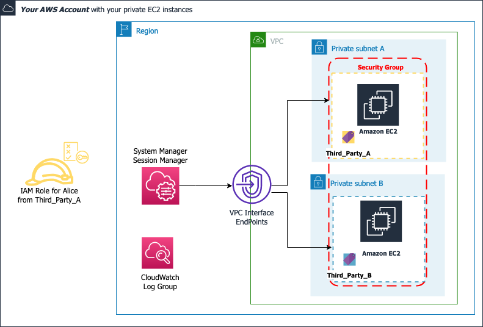

# How to grant least privilege access to third-parties on your private EC2 instances with AWS Systems Manager

This is the repository for the AWS Blog post **How to grant least privilege access to third-parties on your private EC2 instances with AWS Systems Manager**.
You will find here the two CloudFormation templates mentioned in the blog post:
- [1-TheirAWSAccount_AccessConfiguration.yaml](1-TheirAWSAccount_AccessConfiguration.yaml)
- [2-YourAWSAccount_Configuration.yaml](2-YourAWSAccount_Configuration.yaml).

The blog post will demonstrate how to provide least privilege access to third-parties on your private Linux and macOS EC2 instances by using Session Manager [run as support](https://docs.aws.amazon.com/systems-manager/latest/userguide/session-preferences-run-as.html), AWS Security Token Service (AWS STS) and [Attribute-Based Access Control (ABAC)](https://docs.aws.amazon.com/IAM/latest/UserGuide/introduction_attribute-based-access-control.html) to grant access to specific EC2 instances based on the resource tags defined.

For demonstration purposes, the environment in this post consists of EC2 instances hosted in private subnets. [AWS PrivateLink endpoints](https://docs.aws.amazon.com/vpc/latest/privatelink/concepts.html) are used to connect the EC2 instances to AWS services without requiring internet connectivity. Additionally, Session Manager preferences are configured to [stream session log data to Amazon CloudWatch Logs](https://docs.aws.amazon.com/systems-manager/latest/userguide/session-manager-logging.html). Finally, the third-party in this post is defined as an external party to your organization.

## The general workflow 
The figure below describes the workflow of how a third-party can connect on your private EC2 instances from their account.

## Prerequisites
This solution assumes that the following configurations are in place: 
-	One AWS account that will host your EC2 instances. Refer to as ***Your*** account.
-	One AWS account that you can use as mock external third-parties” AWS accounts to test the solution. Refer to as ***Their*** account.
-	[AWS CLI](https://docs.aws.amazon.com/cli/latest/userguide/getting-started-install.html) and [Session Manager plugin for the AWS CLI](https://docs.aws.amazon.com/systems-manager/latest/userguide/session-manager-working-with-install-plugin.html) installed on local computer.

## 1-TheirAWSAccount_AccessConfiguration.yaml
This template needs to be deploy in ***Their*** account to deploy the following resources:
1. create a user group **GroupRemoteAccess**;
2. create and add an IAM user **alice** to that group – alice’s credentials will be stored in AWS Secrets Manager;
3. create one IAM role **3P_IAM_Assume_Role** to be assumed by **alice**, and permitting to assume the IAM role **SSMStartSession_IAM_Role_ThirdPartyA** in your AWS account.

### Role chaining
In ***Their*** account, the third-party will use role chaining to log into ***Your*** account:
1. First they will assume the local IAM role **3P_IAM_Assume_Role** in *Their* account;
2. Then, they will assume the IAm role **SSMStartSession_IAM_Role_ThirdPartyA** in *Your* account.

## 2-YourAWSAccount_Configuration.yaml
In Your account, launch the CloudFormation template 2-YourAWSAccount_Configuration.yaml to create the resources below:
- One VPC with one private subnet,
- Three VPC endpoints for AWS Systems Manager and one VPC endpoint for CloudWatch Logs in the VPC,
- Two tagged EC2 instances in the private subnet having an IAM instance profile for Systems Manager with a managed policy AmazonSSMManagedInstanceCore. SSM agent is preinstalled by default on some Amazon Machine Images (AMIs) such as Amazon Linux 2, which is used for this post
- Security Group (SG) for the VPC endpoints that allows HTTPS traffic inbound from network interfaces that are assigned to the same Security Group. An additional HTTPS inbound rule, from EC2 instances SG
- Security Group (SG) for the EC2 instances that only allows HTTPS outbound traffic to the VPC Endpoints SG
- One CloudWatch Log group.

## License

This library is licensed under the MIT-0 License. See the LICENSE file.

